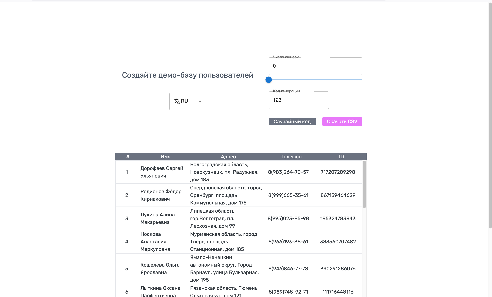

## fake-data

[https://fake-users-5t6b.onrender.com/](https://fake-users-5t6b.onrender.com/)

### Description

This project is one of the iTransition's internship tasks.
Here you can input custom value and get repeatable - random data result
Also, its possible to exportdata to a CSV file and change localization

### Stack

-   TypeScript
-   React
-   Fakerator
-   CSV export library

### Preview

